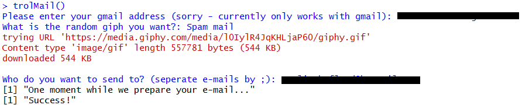
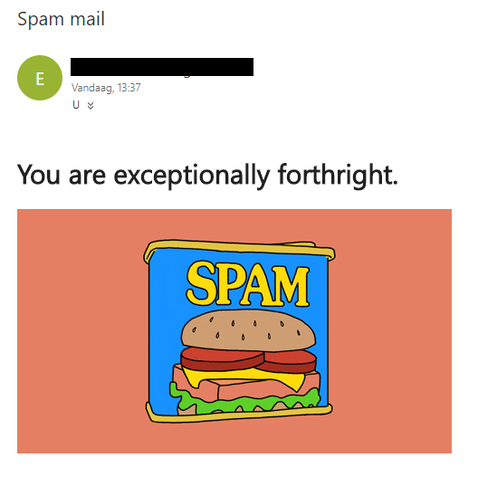

# trolMail

R package to send an useless e-mail

To install, run:
 ```R
if (!require(devtools)) {
  install.packages('devtools')
}
devtools::install_github('Emelieh21/trolMail')
 ```


This package only includes one function `trolmail()` , which generates an email with a random giphy gif and [compliment](http://toykeeper.net/programs/mad/compliments). For this the Giphy API is used and an API key is needed (can be requested [here](https://developers.giphy.com/)). For the `trolMail()` function to work, make sure to save your Giphy API key in your [.Renviron file](https://csgillespie.github.io/efficientR/3-3-r-startup.html#renviron):

_/folder/of/your/home/directory/.Renviron_

```txt
giphy_key=<YOUR_API_KEY>
```


The function works as follows:

### 1: Enter sender e-mail address & password


### 2: Enter a topic & receiver(s) email address(es)



### 3: Your email has been sent!


